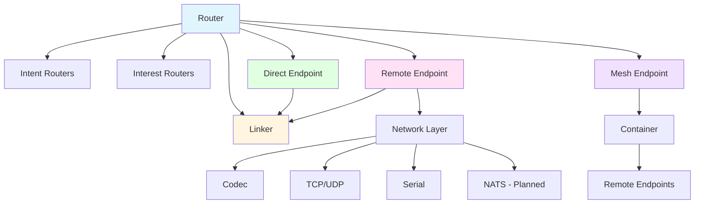
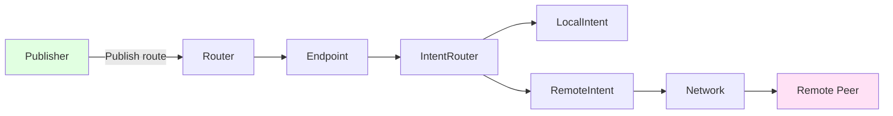
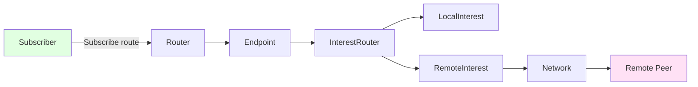
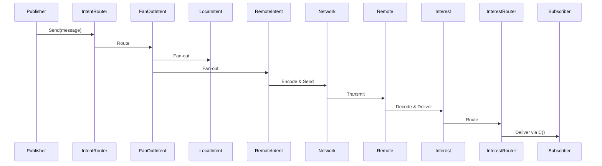
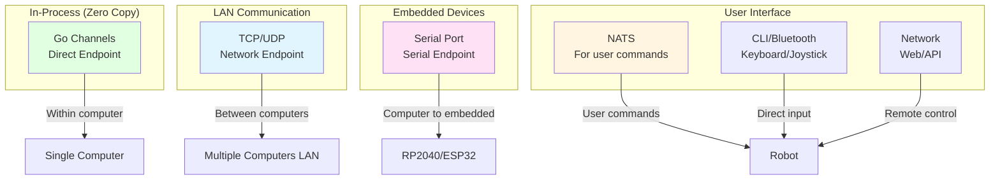

# DNDM Library - Overall Design Document

## Overview

DNDM (Decentralized Named Data Messaging) is a communication library inspired by LibP2P, Named Data Networks, Pub/Sub architectures, and ROS. The primary goal is to provide efficient, typed message passing between multiple servers, devices (IoT, robots, embedded devices), using protobuf specifications with minimal copying.

## Core Concepts

### Architecture Principles

1. **Intent-Interest Pattern**: Similar to Pub/Sub but with stronger typing
   - **Intent**: Declares availability to publish data on a specific route
   - **Interest**: Declares desire to receive data on a specific route
   - **Link**: Automatic connection between matching Intent and Interest

2. **Routes**: Typed, named paths for data streams
   - Format: `TypeName@path` (e.g., `Foo@example.foobar`)
   - Supports plain routes and hashed routes for security
   - Routes combine message type with path for type-safe routing

3. **Endpoints**: Abstraction layer for different communication methods
   - **Direct**: Same process, zero-copy via channels
   - **Remote**: Different processes/systems via network connections
   - **Mesh**: Full-mesh network with automatic peer discovery

4. **Peer-Based Routing**: Path-based prefix matching for distributed routing
   - Each peer has a unique path prefix
   - Routes are matched based on peer path prefixes
   - Enables hierarchical namespace distribution

## Component Architecture



### Core Components

#### Router
- Top-level component managing all endpoints
- Routes intents/interests across endpoints
- Manages IntentRouters and InterestRouters

#### Endpoint Types
1. **Direct Endpoint**: In-process communication
   - Uses channels for zero-copy message passing
   - Links Intent directly to Interest via channels

2. **Remote Endpoint**: Cross-process/system communication
   - Manages network connections
   - Handles intent/interest propagation
   - Manages remote intent/interest wrapping

3. **Mesh Endpoint**: Distributed full-mesh network
   - Manages multiple remote endpoints
   - Peer discovery and address book
   - Handshake protocol for connection establishment

#### Linker
- Connects Intent with Interest when routes match
- Manages lifecycle of links
- Handles notifications when links are established

#### Intent/Interest Routers
- **IntentRouter**: Fan-out to multiple intents
  - Routes messages from one source to multiple destinations
  - Manages wrappers for multiple subscribers

- **InterestRouter**: Fan-in from multiple interests
  - Routes messages from multiple sources to one destination
  - Manages wrappers for multiple publishers

## Data Flow

### Publishing Flow



### Subscription Flow



### Message Flow (Linked)



## Message Protocol

### Frame Format
```
[Magic (4 bytes)] [Total Size (4 bytes)] [Header Size (4 bytes)]
[Header (variable)] [Message Size (4 bytes)] [Message (variable)]
```

### Header Structure (Protobuf)
- `receive_timestamp`: Set by receiver
- `timestamp`: Set by sender
- `type`: Message type enum (MESSAGE, INTENT, INTEREST, etc.)
- `want_result`: Request response
- `signature`: For authentication (future)
- `route`: Route identifier

### Message Types
- `MESSAGE`: Actual data payload
- `INTENT`: Intent advertisement
- `INTENTS`: Batch intent advertisement
- `INTEREST`: Interest advertisement
- `INTERESTS`: Batch interest advertisement
- `NOTIFY_INTENT`: Notification of matching interest
- `PING/PONG`: Latency measurement
- `HANDSHAKE`: Connection establishment
- `PEERS`: Peer discovery
- `ADDRBOOK`: Address book synchronization
- `RESULT`: Response to request

## Key Design Questions

### Routing and Discovery
1. **Route Matching**: How should route matching work in mesh networks?
   - Current: Prefix matching based on peer paths
   - Question: Should we support wildcard routes? Regex? Hierarchical matching rules?

2. **Hashed Routes**: When and how should hashed routes be used?
   - Current: Basic implementation exists
   - Question: What's the security model? How are capabilities distributed?
   - Question: How do peers discover hashed routes without knowing the hash?

3. **Route Collision**: How to handle route collisions?
   - Current: TBD in README
   - Question: Should we support multiple publishers for same route?
   - Question: What happens when two peers have same path but different addresses?

### Network and Connectivity
4. **Peer Discovery**: What discovery mechanisms should be supported?
   - Current: Address book with manual/peer-provided entries
   - Question: Should we support mDNS/Bonjour? DHT? Centralized registry?
   - Question: How to handle NAT traversal?

5. **Connection Management**: How should connections be managed?
   - Current: Full-mesh with automatic dialing
   - Question: Should we support partial mesh? Star topology? Hierarchical?
   - Question: How to handle connection failures and reconnection strategies?

6. **Transport Protocols**: What transport protocols should be supported?
   - Current: TCP/UDP via network package
   - Question: Should we support WebSocket? QUIC? Serial ports (already exists)?
   - Question: How to handle unreliable transports?

### Performance and Scalability
7. **Message Batching**: Should we batch intents/interests?
   - Current: INTENTS/INTERESTS message types exist
   - Question: When should batching be used? Automatic? Configuration?

8. **Buffer Management**: How to handle backpressure?
   - Current: Fixed-size channels
   - Question: Should we support dynamic sizing? Dropping old messages?
   - Question: How to handle slow consumers?

9. **Zero-Copy**: How to maximize zero-copy across network boundaries?
   - Current: Direct endpoint uses channels (zero-copy in-process)
   - Question: Can we use shared memory for local network communication?
   - Question: How to handle message serialization with minimal copying?

### Security and Authentication
10. **Authentication**: How should peers authenticate?
    - Current: No authentication
    - Question: What authentication mechanisms? TLS? mTLS? Token-based?
    - Question: Should authentication be per-peer or per-route?

11. **Authorization**: How to control access to routes?
    - Current: Path-based matching only
    - Question: Should we support ACLs? Capability-based security?
    - Question: How to handle permissions for hashed routes?

12. **Message Signing**: How should message signatures work?
    - Current: Signature field in header (not used)
    - Question: Should all messages be signed? Only control messages?
    - Question: What signing algorithm? Key management?

### Reliability and Fault Tolerance
13. **Message Delivery**: What delivery guarantees should be provided?
    - Current: Best-effort delivery
    - Question: Should we support at-least-once? Exactly-once? Ordered delivery?
    - Question: How to handle message acknowledgment?

14. **Failure Recovery**: How should the system handle failures?
    - Current: Basic error handling, connection closure
    - Question: Should we support automatic retry? Circuit breakers?
    - Question: How to handle partial failures in mesh networks?

15. **State Synchronization**: How to handle state changes?
    - Current: Intent/Interest advertised on creation
    - Question: Should we support re-advertisement on reconnection?
    - Question: How to handle network partitions?

### API and Usability
16. **Type Safety**: How to improve type safety at API level?
    - Current: Route requires proto.Message type
    - Question: Should we support typed wrappers? Generics?
    - Question: How to avoid type casting at consumer side?

17. **Error Handling**: How to handle and propagate errors?
    - Current: Error return values
    - Question: Should we support error channels? Error callbacks?
    - Question: How to distinguish transient vs permanent errors?

18. **Configuration**: How should the library be configured?
    - Current: Options pattern
    - Question: Should we support configuration files? Environment variables?
    - Question: What configuration should be exposed?

### Testing and Observability
19. **Observability**: What metrics and logs should be exposed?
    - Current: Basic logging with slog
    - Question: What metrics should be tracked? Latency? Throughput? Error rates?
    - Question: Should we support distributed tracing?

20. **Testing**: How to test distributed behavior?
    - Current: Unit tests for components
    - Question: Should we support integration tests? Chaos testing?
    - Question: How to test mesh network behavior?

## Potential Issues and Improvements

### Identified Issues

1. **Race Conditions**: 
   - Multiple goroutines accessing shared state in Linker, Router
   - Channel closure race conditions in StreamContext

2. **Resource Leaks**:
   - Goroutine leaks if contexts aren't properly cancelled
   - Buffer pool management could be improved

3. **Error Handling**:
   - Some errors are logged but not propagated
   - Result handling is awkward (TODO comment in remote/messages.go)

4. **Handshake Protocol**:
   - Very rudimentary (FIXME comment in handshake.go)
   - Missing intent/interest synchronization during handshake

5. **Performance**:
   - No message batching implementation
   - Serial encoding/decoding could be optimized
   - No connection pooling for network connections

6. **Documentation**:
   - Limited API documentation
   - No usage examples for mesh networks
   - Missing architecture diagrams

### Areas for Improvement

1. **Protocol Enhancement**:
   - Implement proper handshake with intent/interest exchange
   - Add message batching
   - Implement flow control

2. **Reliability**:
   - Add retry mechanisms
   - Implement circuit breakers
   - Add health checks

3. **Security**:
   - Implement authentication
   - Add message signing
   - Support encryption

4. **Observability**:
   - Add structured metrics
   - Implement distributed tracing
   - Add performance profiling

5. **Testing**:
   - Add integration tests
   - Implement chaos testing
   - Add performance benchmarks

6. **API Ergonomics**:
   - Add typed wrappers
   - Improve error handling
   - Add builder patterns where appropriate

## Usage Context

### Primary Use Case: Robotics Internal Message Bus

DNDM is designed for **controlled environments** where the system topology and message types are known at design time. The primary use case is as an internal message bus for robotics applications.

#### Controlled Environment Assumptions

1. **Known Intent/Interest Set**: The set of intents and interests is more or less known at design time
2. **Known Clients/Producers**: The set of clients and producers is known and controlled
3. **Internal Communication**: Primary focus is internal robot communication, not public-facing APIs

#### Communication Patterns



**Transport Selection**:
- **In-Process**: Go channels via Direct endpoint (zero-copy)
- **LAN (Computer-to-Computer)**: TCP/UDP via Network endpoint
- **Computer-to-Embedded**: Serial ports (e.g., Raspberry Pi ↔ RP2040/ESP32)
- **User Interaction**: 
  - Network (TCP/UDP)
  - NATS (for cloud/external commands)
  - CLI on device (e.g., RPI with Bluetooth keyboard/joystick)

#### Broadcast Support

The system may use **UDP broadcast** to reduce network congestion. When using broadcast:
- Messages are sent to all instances on the network
- Instances **without interest** should **reject packets early** (at network layer)
- Only interested instances process the message
- This reduces network overhead while maintaining efficiency

#### Intentional Design Decisions

Some checks, limits, and validations are **intentionally omitted** in this implementation:

1. **Runtime Validation**: Type checking and route validation assume known, controlled routes
2. **Rate Limiting**: Not implemented by default (can be added as middleware)
3. **Access Control**: No authentication/authorization (trusted environment)
4. **Resource Limits**: No enforced limits on connections, routes, or message sizes

**Rationale**: These can be easily added later due to the modular architecture:
- Middleware pattern for rate limiting
- Wrapper functions for validation
- Endpoint-level access control
- Configuration-based resource limits

#### Requirements
- Efficient typed message passing (zero-copy where possible)
- Minimal copying (direct channels in-process, efficient serialization for network)
- Support for distributed systems (multiple computers, embedded devices)
- Protobuf-based type system (compile-time type safety)
- Works across different network topologies (LAN, serial, in-process)

#### Current Focus
- Single process communication (Direct endpoint)
- LAN communication (TCP/UDP via Network endpoint)
- Serial communication (for embedded devices)
- Basic mesh networking (for automatic peer discovery)
- Zero-copy optimizations (in-process channels)

#### Future Enhancements
- Full authentication/authorization (when needed for less controlled environments)
- Advanced error recovery (circuit breakers, retries)
- Rate limiting middleware
- Resource limit enforcement
- Advanced security features

