# dndm

**Decentralized Named Data Messaging** - A communication library for efficient, typed message passing between servers, IoT devices, robots, and embedded systems.

## Overview

DNDM is inspired by LibP2P, Named Data Networks, Pub/Sub architectures, and ROS. The main purpose is to provide a framework for seamless decentralized, distributed, and modular architectures, primarily for robotic applications.

### Key Features

- **Typed Message Passing**: Type-safe communication using protobuf specifications
- **Zero-Copy**: Efficient in-process communication via channels
- **Automatic Linking**: Intent-Interest pattern automatically connects publishers and subscribers
- **Multiple Transports**: Direct (in-process), Remote (TCP/UDP/Serial), Mesh (full-mesh network)
- **Peer Discovery**: Automatic peer discovery and mesh network formation
- **Route-Based**: Typed routes combine message type with path for type-safe routing

## Architecture

DNDM consists of **Intents** and **Interests** that are communicated and managed via **Endpoints**. Each Intent and Interest is marked with a **Route** that uniquely identifies the data by combining the stream name and message type. A **Linker** connects an Intent with an Interest by routing messages efficiently.


### Core Concepts

#### Intent
An **Intent** declares availability to publish data on a specific route. When an Interest matches an Intent, they are automatically linked, and the Intent receives a notification to start publishing.

#### Interest
An **Interest** declares desire to receive data on a specific route. It's similar to a Subscription in Pub/Sub systems but with stronger typing.

#### Route
A **Route** combines a message type with a path. Format: `TypeName@path` (e.g., `SensorData@sensors.temperature`).

- **Plain Route**: Human-readable format `Foo@example.path`
- **Hashed Route**: Opaque format `prefix#hash` for security (Object-Capability model)

#### Endpoint Types

**Direct Endpoint**: In-process communication using Go channels (zero-copy)

**Remote Endpoint**: Cross-process/system communication via network connections (TCP/UDP/Serial)

**Mesh Endpoint**: Distributed full-mesh network with automatic peer discovery

### Data Flow


## Usage Examples

### Basic Publish-Subscribe

```go
// Publisher
intent, err := router.Publish("sensors.temperature", &TemperatureData{})
if err != nil {
    log.Fatal(err)
}
defer intent.Close()

// Wait for interest
select {
case route := <-intent.Interest():
    // Send data
    intent.Send(ctx, &TemperatureData{Value: 25.5})
}

// Subscriber
interest, err := router.Subscribe("sensors.temperature", &TemperatureData{})
if err != nil {
    log.Fatal(err)
}
defer interest.Close()

// Receive data
for msg := range interest.C() {
    data := msg.(*TemperatureData)
    process(data)
}
```

### Multi-Device Setup

```go
// Create router with multiple endpoints
router, err := dndm.New(
    dndm.WithContext(ctx),
    dndm.WithQueueSize(10),
    dndm.WithEndpoint(direct.New(10)),           // In-process
    dndm.WithEndpoint(remote.New(...)),         // Network
    dndm.WithEndpoint(mesh.New(...)),           // Mesh network
)
```

## Use Cases

### Complex Robot System

This diagram shows a complete robot system with multiple processing modules, sensors, actuators, and decision-making components.

```mermaid
graph TB
    subgraph "Embedded Chip"
        Sensor[Sensors<br/>Produces: SensorData]
        Actuator[Actuators<br/>Consumes: MotorControl]
    end
    
    subgraph "SBC #1 - Camera"
        Camera[Camera Module<br/>Produces: CameraImage]
    end
    
    subgraph "SBC #1 - Image Processing"
        ImageProc[Image Processing<br/>Consumes: CameraImage<br/>Produces: ImageFeatures, DepthMap]
    end
    
    subgraph "SBC #2 - Visual Odometry"
        VIO[Visual Odometry<br/>Consumes: ImageFeatures, DepthMap<br/>Produces: VisualOdometry]
    end
    
    subgraph "SBC #3 - Navigation"
        Nav[Navigation Module<br/>Consumes: VisualOdometry, SensorData, MapData<br/>Produces: Location, Direction]
    end
    
    subgraph "SBC #4 - Map Building"
        MapBuild[Map Building<br/>Consumes: MapUpdate<br/>Produces: MapData]
    end
    
    subgraph "SBC #5 - Decision"
        Decision[Decision Module<br/>Consumes: Location, Direction, UserInput, Goals<br/>Produces: MotorControl]
    end
    
    subgraph "Cloud/User"
        User[User Commands<br/>via NATS<br/>Produces: UserInput, Goals]
    end
    
    Sensor -->|SensorData| Nav
    Camera -->|CameraImage| ImageProc
    ImageProc -->|ImageFeatures, DepthMap| VIO
    VIO -->|VisualOdometry| Nav
    MapBuild -->|MapData| Nav
    Nav -->|Location, Direction| Decision
    User -->|UserInput, Goals| Decision
    Decision -->|MotorControl| Actuator
    
    style Sensor fill:#e1f5ff
    style Actuator fill:#ffe1f5
    style Camera fill:#e1f5ff
    style ImageProc fill:#fff5e1
    style VIO fill:#fff5e1
    style Nav fill:#fff5e1
    style MapBuild fill:#fff5e1
    style Decision fill:#e1ffe1
    style User fill:#f0f0f0
```



**Message Routes**:
- `SensorData@sensors.data`
- `CameraImage@cameras.front`
- `ImageFeatures@image.features`
- `DepthMap@image.depth`
- `VisualOdometry@odometry.visual`
- `MapData@map.global`
- `Location@navigation.location`
- `Direction@navigation.direction`
- `MotorControl@actuators.motors`
- `UserInput@user.commands`
- `Goals@mission.goals`

### Simple Sensor Fusion (Embedded + Raspberry Pi)

A simpler use case with a sensor chip connected to a Raspberry Pi via serial port.


**Message Routes**:
- Input: `SensorData@sensors.raw` (from sensor chip)
- Output: `SensorFusion@sensors.fused` (contains Position, Orientation, Velocity Vector, Rotation Vector)

**Configuration**:
```go
// Sensor chip peer
sensorPeer := "serial:///dev/ttyUSB0/sensors.chip?baud=115200"

// Raspberry Pi peer
rpiPeer := "tcp://192.168.1.100:8080/rpi.fusion"
```

### Stereo Camera Processing

Multiple Raspberry Pi devices processing left and right camera feeds in parallel, then combining results.


**Message Routes**:
- `CameraImage@cameras.left` - Left camera feed
- `CameraImage@cameras.right` - Right camera feed
- `ImageFeatures@left.features` - Processed left features
- `ImageFeatures@right.features` - Processed right features
- `StereoData@stereo.result` - Final stereo processing result

**Network Topology**:
- RPI #1, #2, #3, #4 connected via mesh network or TCP
- All devices discover each other automatically
- Messages route based on route prefixes and peer paths

## Transport Protocols

### Direct (In-Process)
- Zero-copy message passing via Go channels
- No network overhead
- Perfect for multi-module applications

### TCP/UDP
- Standard network protocol
- Peer format: `tcp://host:port/path` or `udp://host:port/path`
- Reliable delivery (TCP) or low-latency (UDP)

### Serial
- Serial port communication
- Peer format: `serial:///dev/ttyUSB0/path?baud=115200`
- Parameters: baud, parity, stop bits, data bits

### NATS (Planned)
- Pub/Sub message broker
- Peer format: `nats://nats-server:4222/path`
- Supports JetStream for persistence
- Automatic message routing

## Routes

A Route combines a message type with a path: `TypeName@path`

**Examples**:
- `SensorData@sensors.temperature`
- `CameraImage@cameras.front`
- `MotorControl@actuators.motors`
- `Location@navigation.position`

**Route Rules**:
- Path must not contain `@` or `#` characters
- TypeName is the protobuf message name
- Path is hierarchical (dot-separated)

### Peer Paths and Routing

Each peer has a path that acts as a namespace prefix:

- Peer A: `tcp://192.168.1.1:8080/robot.sensors`
- Peer B: `tcp://192.168.1.2:8080/robot.processors`

Peer A publishes `SensorData@robot.sensors.temperature` → Routed to Peer B if B subscribes to routes matching `robot.sensors.*`

## Getting Started

### Installation

```bash
go get github.com/itohio/dndm
```

### Basic Example

```go
package main

import (
    "context"
    "log"
    
    "github.com/itohio/dndm"
    "github.com/itohio/dndm/endpoint/direct"
    "google.golang.org/protobuf/proto"
)

func main() {
    ctx := context.Background()
    
    // Create router with direct endpoint
    router, err := dndm.New(
        dndm.WithContext(ctx),
        dndm.WithQueueSize(10),
        dndm.WithEndpoint(direct.New(10)),
    )
    if err != nil {
        log.Fatal(err)
    }
    defer router.Close()
    
    // Publisher
    var msg proto.Message
    intent, err := router.Publish("example.data", msg)
    if err != nil {
        log.Fatal(err)
    }
    
    // Subscriber
    interest, err := router.Subscribe("example.data", msg)
    if err != nil {
        log.Fatal(err)
    }
    
    // Use intent/interest...
}
```

### Network Example

```go
import (
    "github.com/itohio/dndm/endpoint/mesh"
    "github.com/itohio/dndm/network"
    "github.com/itohio/dndm/network/net"
)

// Create network node
peer, _ := dndm.PeerFromString("tcp://localhost:8080/robot")
node, _ := net.New(slog.Default(), peer)
factory, _ := network.New(node)

// Create mesh endpoint
meshEP, _ := mesh.New(
    peer,
    10,                    // buffer size
    5,                     // num dialers
    time.Second*10,        // timeout
    time.Second*3,         // ping duration
    factory,
    nil,                   // peers
)

// Create router with mesh endpoint
router, _ := dndm.New(
    dndm.WithContext(ctx),
    dndm.WithEndpoint(meshEP),
)
```

## Documentation

- [DESIGN.md](DESIGN.md) - Overall design and architecture
- [SPEC.md](SPEC.md) - Core package specification
- [COMMUNICATION_AND_USAGE_SPEC.md](COMMUNICATION_AND_USAGE_SPEC.md) - Protocol and usage patterns
- [ISSUES_AND_IMPROVEMENTS.md](ISSUES_AND_IMPROVEMENTS.md) - Known issues and improvements

### Package Specifications

- [endpoint/direct/SPEC.md](endpoint/direct/SPEC.md) - Direct endpoint specification
- [endpoint/remote/SPEC.md](endpoint/remote/SPEC.md) - Remote endpoint specification
- [endpoint/mesh/SPEC.md](endpoint/mesh/SPEC.md) - Mesh endpoint specification
- [network/SPEC.md](network/SPEC.md) - Network layer specification
- [codec/SPEC.md](codec/SPEC.md) - Codec specification

## Status

This is the initial version focusing on:
- ✅ In-process communication (Direct endpoint)
- ✅ Cross-process communication (Remote endpoint via TCP/UDP/Serial)
- ✅ Full-mesh network (Mesh endpoint)
- ✅ Automatic peer discovery
- ✅ Route-based typed message passing
- ✅ Protobuf message support
- 🔄 NATS transport (planned)

## Contributing

Contributions are welcome! Please see the design documents and specifications before implementing new features.

## License

[License information]
